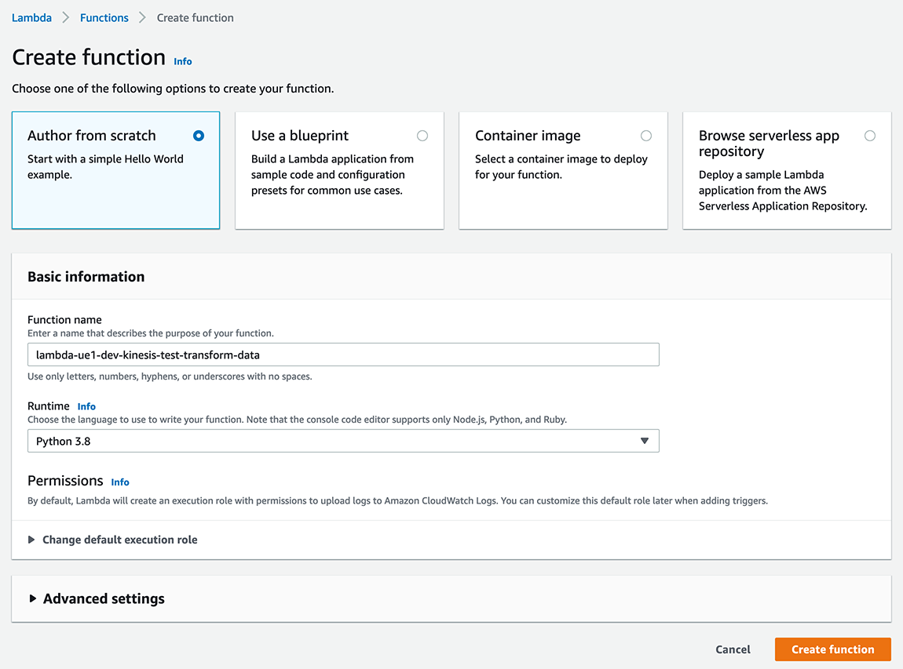
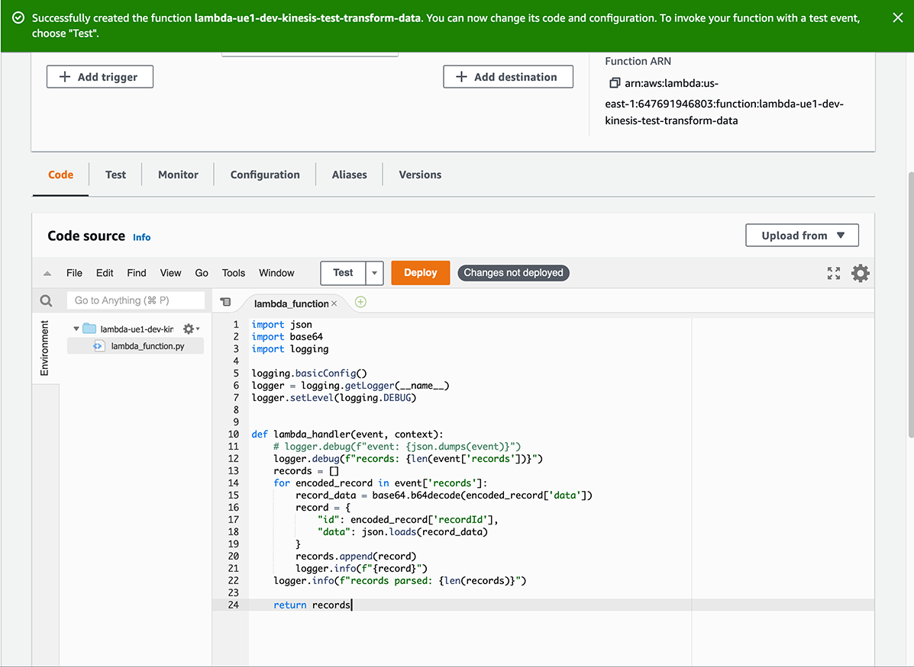
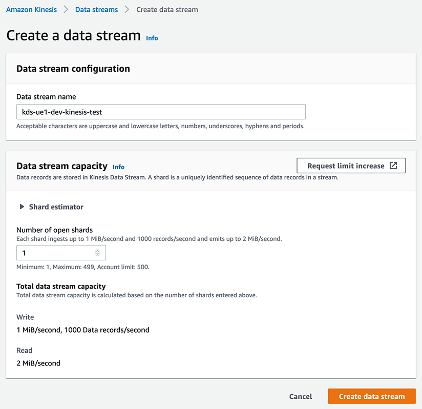
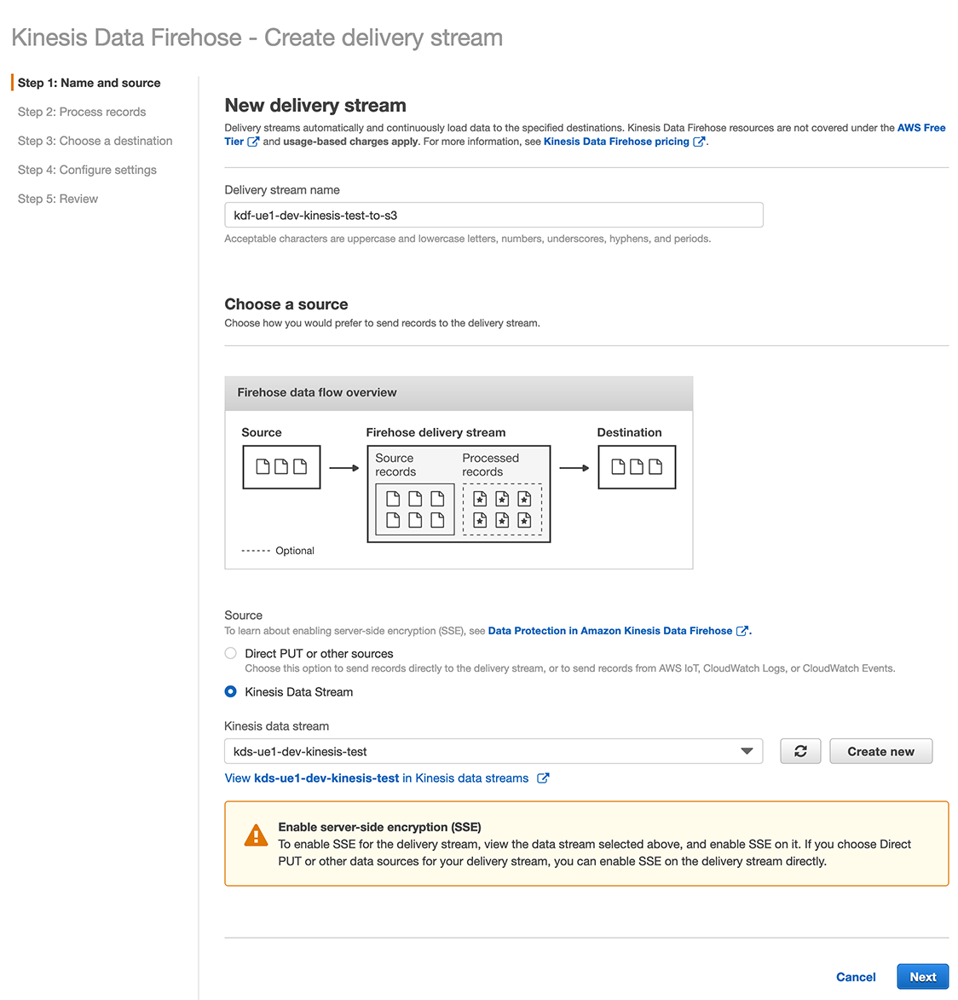
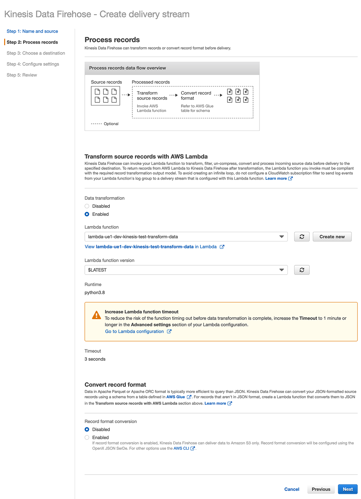
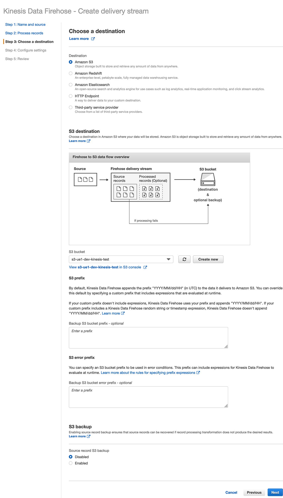
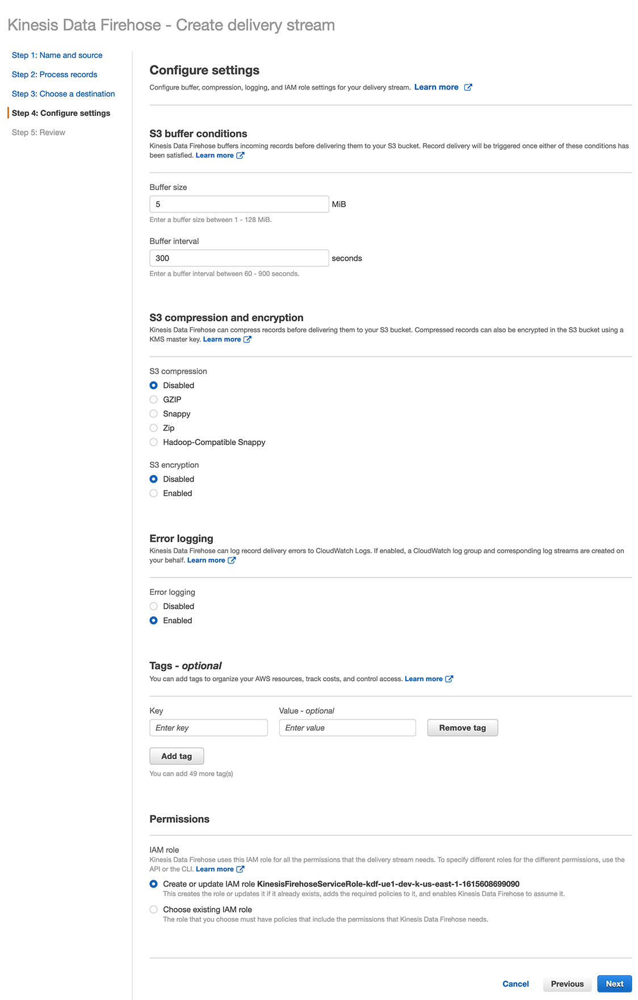
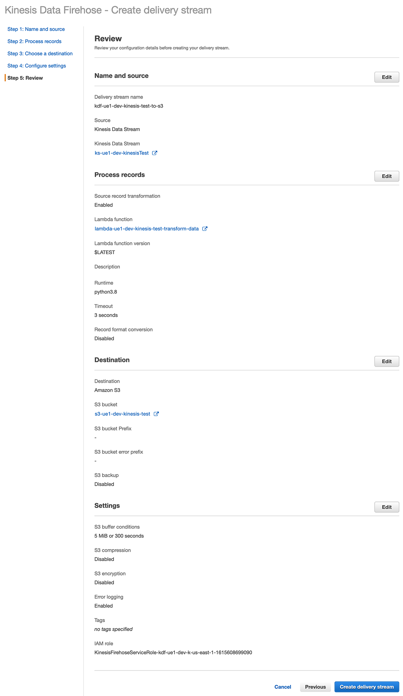

# Python Kinesis Data Stream to S3 Example
This example ([app.py](app.py)) gets randomly generated user data from the [Random User API](https://randomuser.me/) and then puts each record in a Kinesis Data Stream.

A Kinesis Data Firehose delivery stream then processes the Data Stream, transforms the records using a Lambda (see code in [lambda_function.py](lambda_function.py)), and puts them in an S3 bucket.

## Setup the Lambda
1. Create a new Lambda function via the AWS Console:

2. In the console's code editor, double-click on **lambda_function.py**.
3. Replace all the code with the code from [lambda_function.py](lambda_function.py):

4. Click **Deploy**
5. Select Test > Configure Test Event
6. Enter an Event name ("BasicTest")
7. Copy the contents of [sample_lambda_event.json](sample_lambda_event.json) to the event body (it's a large chunk of JSON)
8. Click **Create**
9. Click **Test** to confirm the Lambda works

## Setup an S3 Bucket
Create an S3 bucket to recieve the data

## Setup the Kinesis Data Stream
Configure the Kinesis Data Stream via the AWS Console:
1. Enter a name
2. Enter a number of shards (1 for testing purposes)

## Setup the Kinesis Data Firehose delivery stream
Configure a delivery stream to put call the Lambda and  the records in S3:
1. Enter a name
2. Select **Kinesis Data Stream**
3. Select the data stream set up in the previous step
4. Click **Next**

5. Under **Transform source records with AWS Lambda** select **Enabled**
6. Select the Lambda previously created
7. Click **Next**

8. Destination should be **Amazon S3**
9. Select the S3 bucket previously created
10. **Source record S3 backup** should be Disabled for testing
11. Click **Next**

12. Leave all setting on step 4 at their defaults
13. Click **Next**

14. Review then click **Create delivery stream**

## Setup the Test App
<pre>pip install -R requirements.txt</pre>
In [app.py](app.py) scroll down to the <code>if __name__ == '__main__':</code> block and change the following values before running:
 * <code>stream_name</code> (str) is the name of the Kinesis Data Stream previously created.  The app will check to see if the stream exists on the AWS account.  
If not, it will try to create the stream prior to getting the randomly generated user data.
   Example value: <code>'kds-ue1-dev-kinesis-test'</code>
 * <code>count</code> (int) is the number of randomly generated user records it will get from the [Random User API](https://randomuser.me/). Example value: <code>100</code>

Run/Debug app.py
